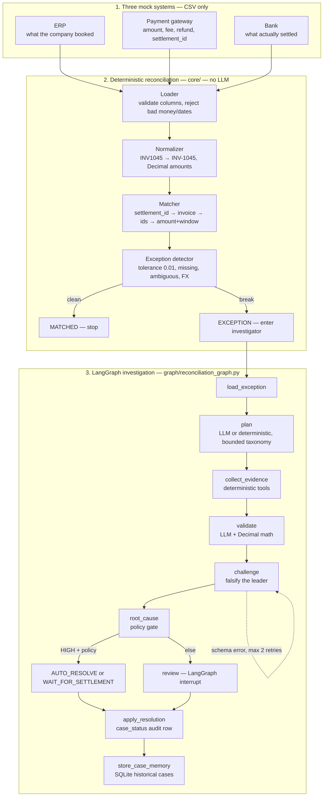

# AI Financial Reconciliation Investigator

An unexplained mismatch is not a matching problem. It is an investigation problem.

This app loads mock ERP, payment-gateway, and bank CSVs, matches them with deterministic rules, and investigates only the exceptions. A LangGraph workflow ranks a bounded hypothesis set, retrieves source-backed facts, challenges its own leader, then explains the root cause and recommends auto-resolve, wait, or human review.

Python owns money, matching, and retrieval. AI may rank hypotheses and write the explanation. It never invents amounts, fees, refunds, or history.

Hero case `INV-1045`: ERP ₹10,000, gateway ₹10,000, bank ₹9,700. Root cause `gateway_fee`. HIGH confidence. `AUTO_RESOLVE`.

Editable board: [`docs/submission-architecture.excalidraw`](docs/submission-architecture.excalidraw). Product contract: [`TECHNICAL_SPEC.md`](TECHNICAL_SPEC.md).

## Architecture

```text
ERP CSV          Gateway CSV          Bank CSV
   |                  |                   |
   +--------+---------+---------+---------+
            v
   Loader → Normalizer → Matcher → Exception detector
                                      |              |
                                   MATCHED       EXCEPTION
                                      |              |
                                     END             v
                                          LangGraph investigator
```



### What each layer owns

| Layer | Code | Owns |
|---|---|---|
| Sources | `data/*.csv` | ERP booked amount, gateway fee/refund, bank settlement. No live APIs. |
| Deterministic core | `core/` | Load, validate, normalize, match, isolate exceptions. Matched records never call the investigator. |
| Investigation graph | `graph/reconciliation_graph.py` | Checkpointed LangGraph with `SqliteSaver`. Nodes listed above. |
| Evidence tools | `tools/` | Facts with source, record id, value, retrieval status. `NOT_FOUND` is not `SOURCE_UNAVAILABLE`. |
| AI-assisted nodes | `agents/` | Planner, validator, challenger, recommendation. Structured JSON via OpenRouter `ChatOpenAI`. Schema-validated. Deterministic fallbacks if LLM is off. |
| Policy | `config.py` | Thresholds live in code, not in prompts. |
| UI | `ui/app.py` | Streamlit control room: explanation first, live agent path, human interrupt. |

### Controlled hypotheses (`schemas.py`)

`gateway_fee` · `refund` · `timing_difference` · `manual_adjustment` · `duplicate_or_missing_transaction` · `unknown_other`

Planner output is enum-validated. There is no free-form cause chain.

### Decision policy (`config.py`)

- HIGH ≥ 0.90, required evidence present, no material contradiction
- MEDIUM 0.70–&lt;0.90 · LOW &lt; 0.70
- `AUTO_RESOLVE` also needs at least two facts and amount ≤ ₹500
- No hypothesis ≥ 0.70 → `unknown_other` + `HUMAN_REVIEW`
- Invalid LLM JSON: retry once, then human review

### Evidence tools (`tools/`)

`get_gateway_transaction` · `get_fee_configuration` · `get_bank_settlement` · `get_refund_record` · `get_related_transactions` · `search_historical_cases`

Tools return facts. They do not decide whether a hypothesis is true.

### Demo cases the UI must show

1. Easy win — gateway fee, high confidence, auto-resolve
2. Refund — evidence explains the shortfall
3. Hard case — competing or missing evidence, safe human-review abstention

## Python environment

This project uses a local virtual environment in `.venv`. Create and activate it
with:

```bash
python3 -m venv .venv
source .venv/bin/activate
python -m pip install --upgrade pip
python -m pip install -r requirements.txt
```

The dependencies include:

- `pandas` for reading and processing CSV files
- `langchain` and `langchain-openai` (`ChatOpenAI`) for LLM calls
- `langgraph` for stateful, graph-based workflows

```bash
streamlit run ui/app.py
```

The standard-library `csv` module is available without an additional install.

## LLM smoke test

Copy `.env.example` to `.env` and set `OPENROUTER_API_KEY`. The default path is
LangChain `ChatOpenAI` pointed at OpenRouter:

```python
ChatOpenAI(
    model=os.environ["RECONCILIATION_LLM_MODEL"],
    api_key=os.environ["OPENROUTER_API_KEY"],
    base_url="https://openrouter.ai/api/v1",
)
```

```bash
.venv/bin/python scripts/llm_smoke_test.py --invoice-id INV-1045
```

The script prints the active provider/model, confirms whether the expected key
is present without exposing it, then shows the real structured outputs from the
planner, validator, and challenger. Calls time out after
`RECONCILIATION_LLM_TIMEOUT_SECONDS` (default 45).
